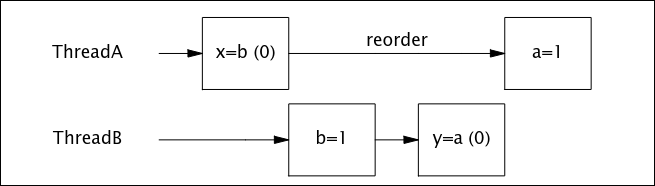

Chapter 13. Explicit Locks
1. Performance is a moving target; yesterday’s benchmark showing that X is faster than Y may already be out of date today.
2. ReentrantLock is an advanced tool for situations where intrinsic locking is not practical. Use it if you need its advanced features: timed, polled, or interruptible lock acquisition, fair queueing, or non-block-structured locking. Otherwise, prefer synchronized.

Chapter 14. Building Custom Synchronizers
1. Document the condition predicate(s) associated with a condition queue and the operations that wait on them.
2. Every call to wait is implicitly associated with a specific condition predicate. When calling wait regarding a particular condition predicate, the caller must already hold the lock associated with the condition queue, and that lock must also guard the state variables from which the condition predicate is composed.
3. When using condition waits (Object#wait or Condition#await):
   * Always have a condition predicate—some test of object state that must hold before proceeding;
   * Always test the condition predicate before calling wait, and again after returning from wait;
   * Always call wait in a loop;
   * Ensure that the state variables making up the condition predicate are guarded by the lock associated with the condition queue;
   * Hold the lock associated with the condition queue when calling wait, notify, or notifyAll;
   * Do not release the lock after checking the condition predicate but before acting on it.
4. Whenever you wait on a condition, make sure that someone will perform a notification whenever the condition predicate becomes true.
5. Single notify can be used instead of notifyAll only when both of the following conditions hold:
   * Uniform waiters. Only one condition predicate is associated with the condition queue, and each thread executes the same logic upon returning from wait;
   * One-in, one-out. A notification on the condition variable enables at most one thread to proceed.
6. Hazard warning: The equivalents of wait, notify, and notifyAll for Condition objects are await, signal, and signalAll. However, Condition extends Object, which means that it also has wait and notify methods. Be sure to use the proper versions—await and signal—instead!

Chapter 15. Atomic Variables and Nonblocking Synchronization
1. Treiber’s stack:

2. Michael-Scott nonblocking linked-queue:
* intermediate state:

* quiescent state:

Chapter 16. The Java Memory Model
1. Reordering from PossibleReordering:

2. The rules for happens-before are:
   * <b>Program order rule.</b> Each action in a thread happens-before every action in that thread that comes later in the program order.
   * <b>Monitor lock rule.</b> An unlock on a monitor lock happens-before every subsequent lock on that same monitor lock.
   * <b>Volatile variable rule.</b> A write to a volatile field happens-before every subsequent read of that same field.
   * <b>Thread start rule.</b> A call to Thread#start on a thread happens-before every action in the started thread.
   * <b>Thread termination rule.</b> Any action in a thread happens-before any other thread detects that thread has terminated, either by successfully return from Thread#join or by Thread#isAlive returning false.
   * <b>Interruption rule.</b> A thread calling interrupt on another thread happens-before the interrupted thread detects the interrupt (either by having InterruptedException thrown, or invoking isInterrupted or interrupted).
   * <b>Finalizer rule.</b> The end of a constructor for an object happens-before the start of the finalizer for that object.
   * <b>Transitivity.</b> If A happens-before B, and B happens-before C, then A happens-before C.
3. Happens-before in the Java Memory Model:

4. With the exception of immutable objects, it is not safe to use an object that has been initialized by another thread unless the publication happens-before the consuming thread uses it.
5. Initialization safety guarantees that for properly constructed objects, all threads will see the correct values of final fields that were set by the constructor, regardless of how the object is published. Further, any variables that can be reached through a final field of a properly constructed object (such as the elements of a final array or the contents of a HashMap referenced by a final field) are also guaranteed to be visible to other threads.
6. Initialization safety makes visibility guarantees only for the values that are reachable through final fields as of the time the constructor finishes. For values reachable through nonfinal fields, or values that may change after construction, you must use synchronization to ensure visibility.